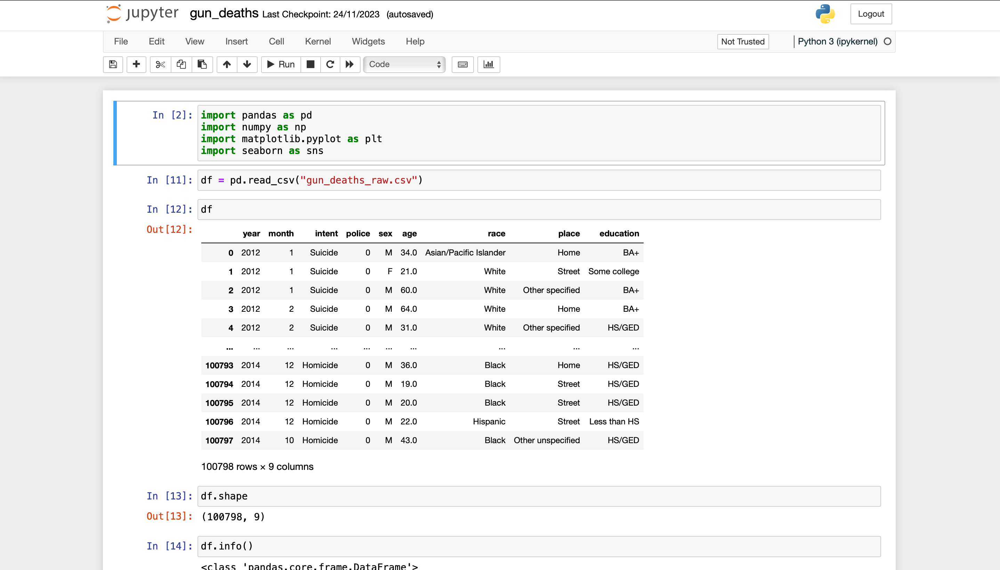
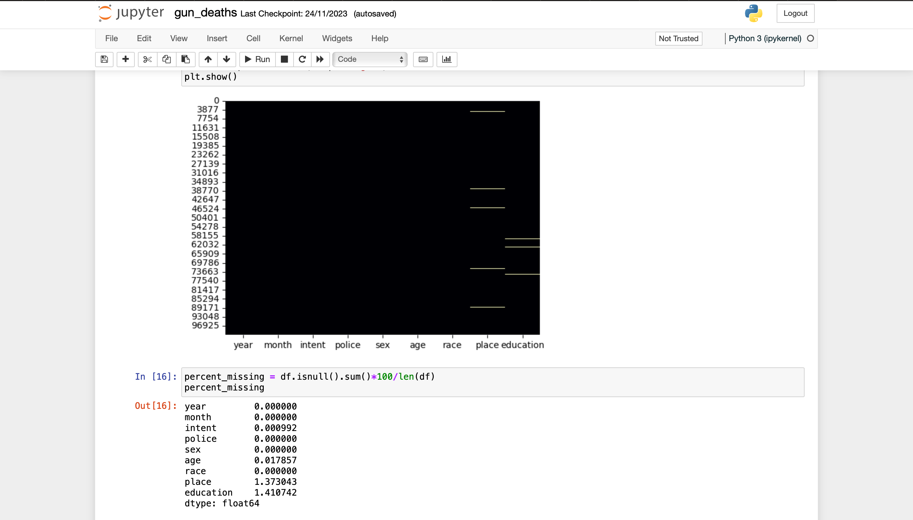
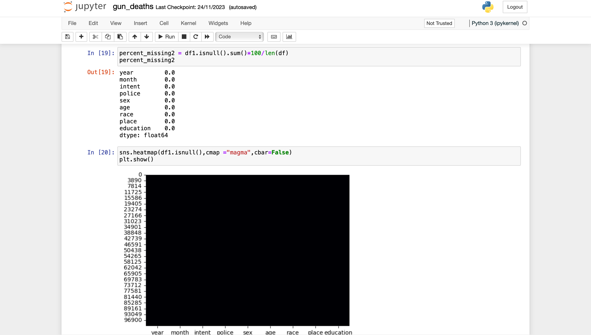
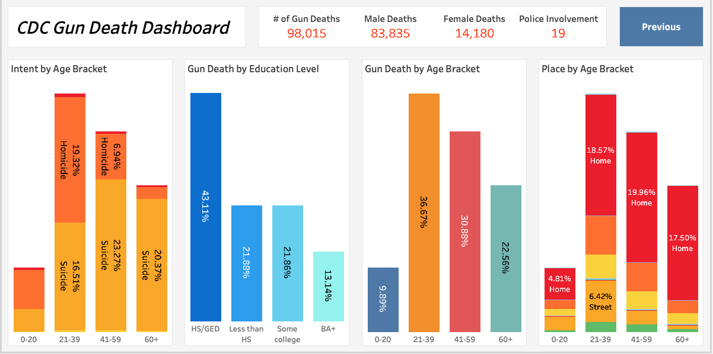

# CDC-GunDeath-Analysis

# Gun Deaths in America Dataset Analysis

## Overview

This repository contains a dataset and analysis related to gun deaths in America from 2012 to 2014, as reported by the Centers for Disease Control and Prevention (CDC). The dataset includes information on the year, month, intent, police involvement, sex, age, race, place, and education of the deceased, providing a comprehensive view of the phenomenon.

## Dataset Columns

- **Year:** The year when the death occurred.
- **Month:** The month of the incident.
- **Intent:** Categorizes the death by intent (e.g., suicide, homicide).
- **Police:** Indicates police involvement in the death.
- **Sex:** Gender of the deceased.
- **Age:** Age of the deceased.
- **Race:** Race of the deceased.
- **Place:** Location of the incident (e.g., home, street).
- **Education:** Educational background of the deceased.

## Analysis and Visualization

I have cleaned the dataset by removing duplicates and blank spaces, and carried out light exploratory data analysis (EDA). The insights gained from this analysis are visualized using Tableau, with detailed worksheets to facilitate easy interpretation.

## Tableau Dashboards

The repository includes Tableau dashboard that provide interactive visualizations, making it easier to explore patterns, trends, and disparities in gun deaths in America. The visualizations offer a nuanced understanding of the data, contributing to a more informed discussion on this critical issue. Below are pictures of the dashboard made with Tableau

### Dashboard 1

### Dashboard 2

### Link to Dashboard
Explore the interactive dashboards on [Tableau Public](https://public.tableau.com/views/CDC-GunDeathDashboard/Dashboard1?:language=en-GB&:display_count=n&:origin=viz_share_link)

## Usage

Feel free to use and adapt the dataset and analysis for your research or projects. If you find the insights valuable, consider citing or referencing this repository.

## Contributing

If you have suggestions for improvement or additional analyses, please open an issue or submit a pull request. Contributions are welcome!

## License

This project is licensed under the [MIT License](LICENSE.md).

